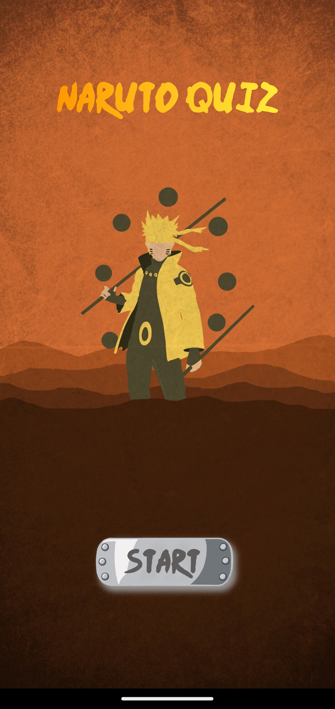
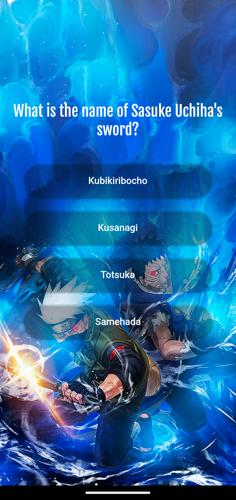
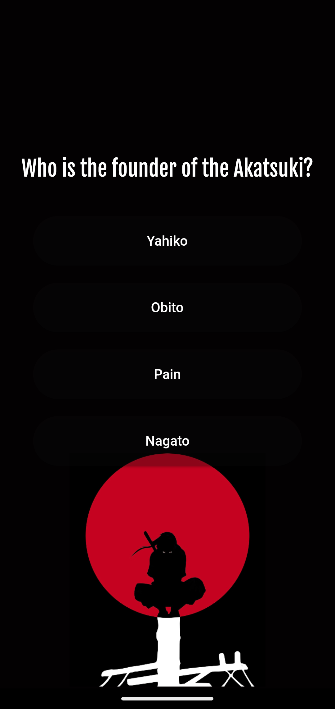
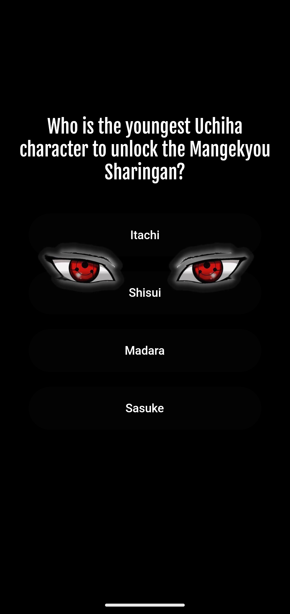
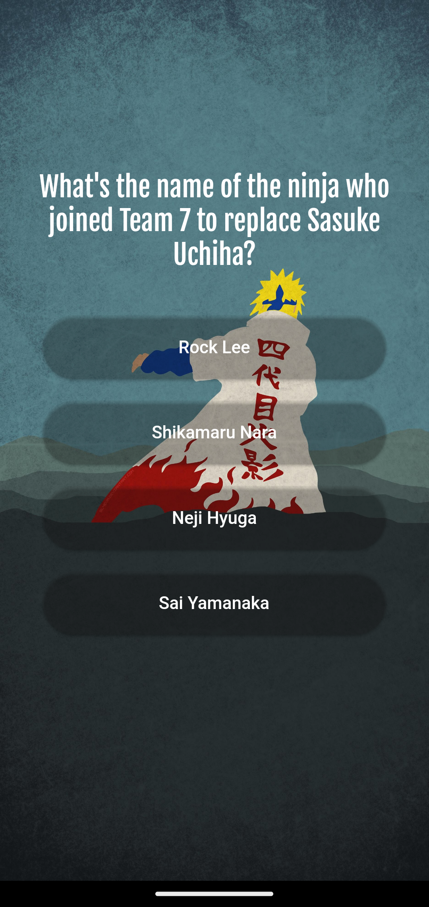
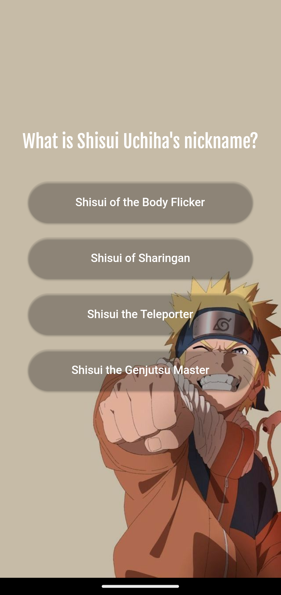
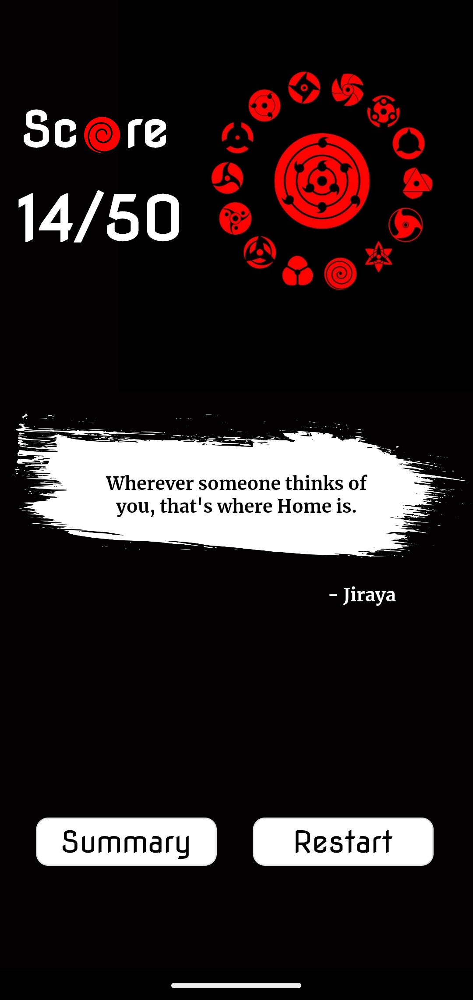
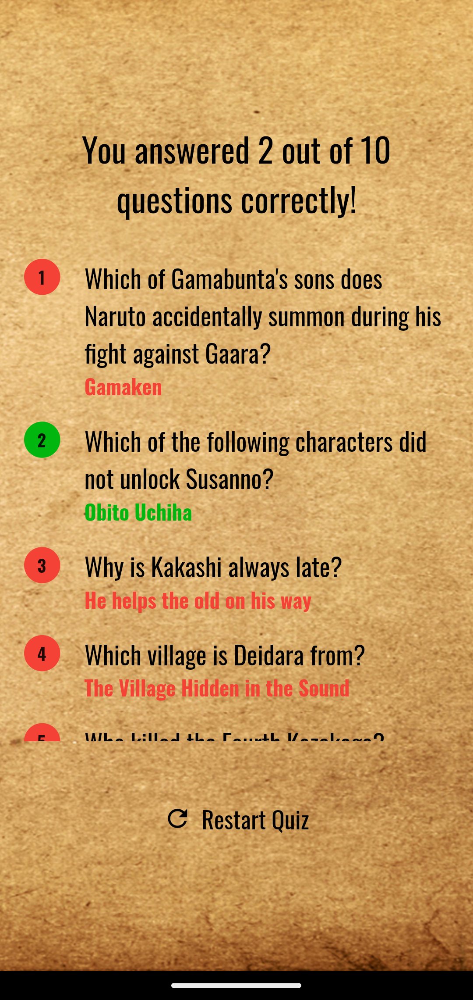

# Naruto Quiz Dash

A captivating Naruto Quiz game developed using Flutter. Test your knowledge, choose your challenge, and immerse yourself in the world of ninjas and epic battles. Dive in and become the ultimate Naruto aficionado!

## Code
- The Application is build using **Flutter**, a.k.a. **Dart**.

## View
###Android Studio
-   - For Android:

Enable Developer options and USB debugging on your device. This varies slightly by Android version, but the short version is you tap on the Device Build Number 7 times. Then a "Developer Options" option comes up and you can click "enable USB Debugging." See the linked Android documentation for the most up-to-date instructions.
Then plug your phone into your computer with a USB cable. You'll probably see some popup on your phone asking if you want to allow USB debuggng with that computer. Say "yes".
Run Flutter just like you would if you had a simulator running.

----------------------------------------------------------------------------------------------------------------------------------------------------------------------
## Sample Screenshots
                                                       
